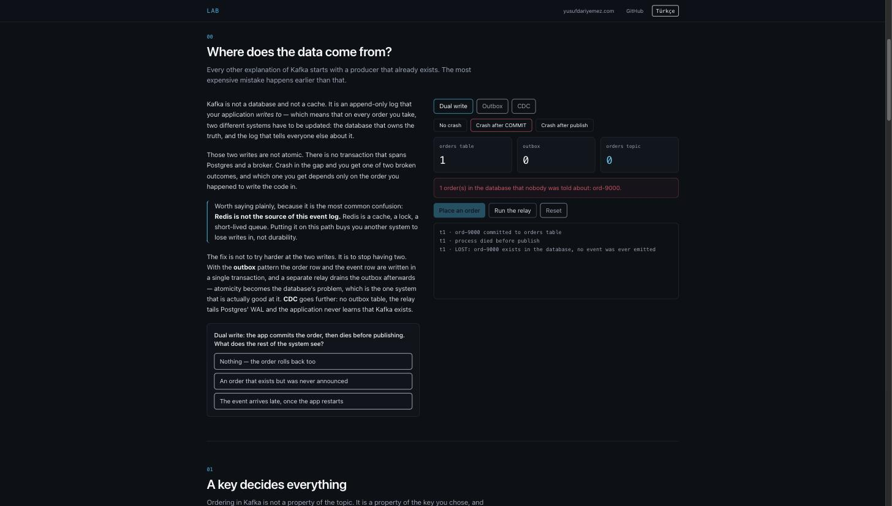
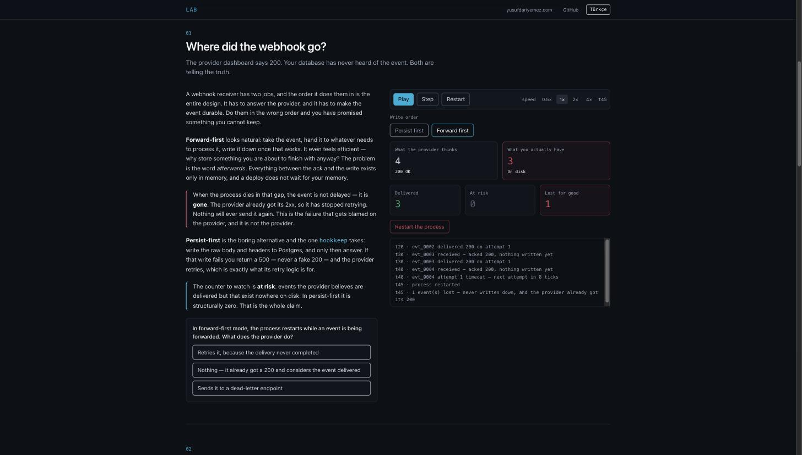
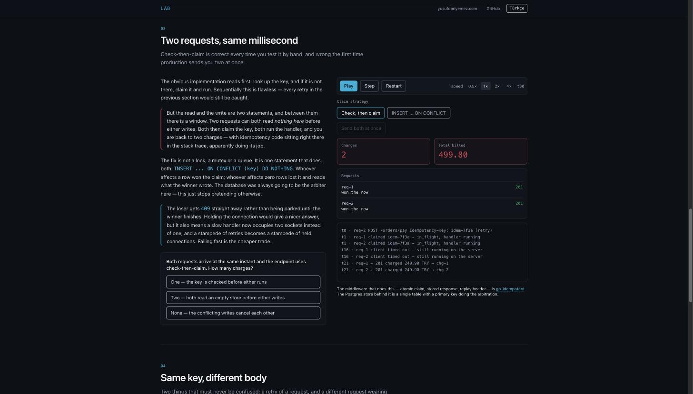
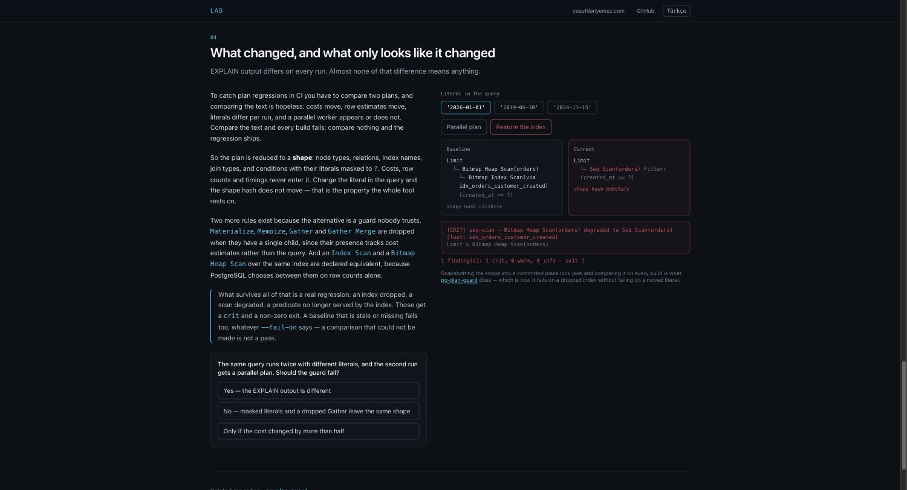
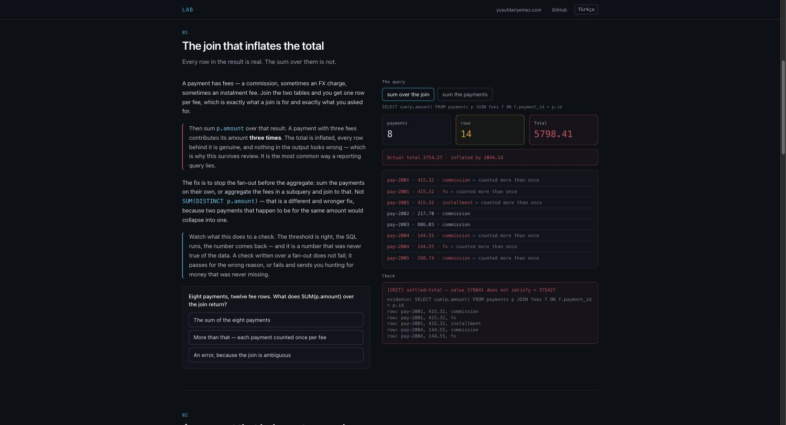

# lab

[English](README.md) | **Türkçe**

Backend sistemlerinin interaktif anlatımı — ancak bozulduklarını izleyince
anlam kazanan kısımları.

Yayında: **[lab.yusufdariyemez.com](https://lab.yusufdariyemez.com)** — İngilizce
`/`, Türkçe `/tr`.

Anlatımların çoğu mimariyi gösterir: kutular, oklar, happy path. Zaten kolay
kısmı orası. Sana bir geceye mal olan şey davranıştır — bir process işin
ortasında öldüğünde, bir kuyruk tek bir bozuk mesajın arkasında biriktiğinde, iki
sistem neyin yazıldığı konusunda anlaşamadığında ne olur. Her lab kontrolleri
sana veriyor; bozan kontroller dahil.

Her şey tarayıcıda çalışıyor. Broker yok, backend yok, network çağrısı yok. Her
simülasyon deterministik bir model, yani aynı seed hep aynı olayı tekrar
oynatıyor; duraklat / adımla / baştan başlat tam beklediğin gibi çalışıyor.

| Lab | Konu | Bölüm |
|-----|------|-------|
| [Kafka, davranışıyla](https://lab.yusufdariyemez.com/tr/kafka) | Apache Kafka · [kafka-dlq](https://github.com/YusufDrymz/kafka-dlq) | 6 |
| [Webhook'lar ve nereye gittikleri](https://lab.yusufdariyemez.com/tr/hookkeep) | Webhook · [hookkeep](https://github.com/YusufDrymz/hookkeep) | 4 |
| [Aynı istek, iki kez](https://lab.yusufdariyemez.com/tr/idempotency) | Idempotency · [go-idempotent](https://github.com/YusufDrymz/go-idempotent) | 4 |
| [Bu sorgu production'da patlar](https://lab.yusufdariyemez.com/tr/plans) | Query plan'leri · [pg-plan-guard](https://github.com/YusufDrymz/pg-plan-guard) | 4 |
| [Sayılar tutmuyor](https://lab.yusufdariyemez.com/tr/reconcile) | Veri bütünlüğü · [data-watchdog](https://github.com/YusufDrymz/data-watchdog), [go-reconcile](https://github.com/YusufDrymz/go-reconcile) | 4 |

---

## Kafka, davranışıyla

Producer'lar, broker'lar ve aralarında oklar olan kutular başka yerlerde
fazlasıyla anlatılıyor; bu yüzden burası onları atlayıp doğrudan incident'a
sebep olan davranışa giriyor.



| # | Bölüm | Ne gösteriyor |
|---|-------|----------------|
| 0 | Yazma yolu | Dual write'lar atomik değil. `COMMIT` ile publish arasında crash olursa sipariş var ama kimsenin haberi yok; önce publish edip rollback olursa hiç var olmamış bir sipariş için event yayınlamış olursun. Sonra aynı crash outbox pattern'ı ve CDC'ye karşı. |
| 1 | Partition'lar | Key'ler murmur2 ile hash'lenip bir partition'a sabitleniyor. Sıralama topic başına değil key başına. Çarpık trafik bir partition'ı ısıtıyor ve consumer eklemek bunu çözmüyor. |
| 2 | Consumer group'lar | Partition'lar grup içinde bölüşülüyor, her birinin tek sahibi var. Partition sayısı paralelliğin sert tavanı — fazla consumer boşta bekliyor. |
| 3 | Rebalance | Eager rebalance dünyayı durdururken producer'lar yazmaya devam ediyor. Cooperative sticky yalnız yer değiştireni geri alıyor. `max.poll.interval.ms` rebalance döngüsü de dahil. |
| 4 | Offset'ler | İşlemeden önce commit at-most-once, sonra commit at-least-once. Consumer'ı kayıt işlenirken öldür ve hangisini seçtiğini gör. |
| 5 | Dead letter'lar | Yerinde retry, zehirli mesajın arkasındaki partition'ı bloke ediyor. Retry topic'leri bunu açıyor. Hatayı düzeltmeden DLQ'yu replay etmek incident'ı döngüye sokuyor. |

## Webhook'lar ve nereye gittikleri

Bir sağlayıcı event gönderiyor ve hızlıca 2xx bekliyor. Endpoint'in yavaş, ya da
restart oluyor, ya da kısa süre düşük. Sağlayıcı birkaç kez deniyor, vazgeçiyor
ve iletimi başarılı işaretliyor. Event nerede?



| # | Bölüm | Ne gösteriyor |
|---|-------|----------------|
| 0 | Önce yaz | Forward-first, hiçbir şey yazmadan önce sağlayıcıya ack veriyor. Teslimat sürerken process'i restart et ve event gitti — kalıcı olarak, çünkü sağlayıcı 200'ünü çoktan aldı ve denemeyi bıraktı. Persist-first, *risk altında* sayacını yapısal olarak sıfırda tutuyor. |
| 1 | Retry | `base * 2^(attempt-1)`, tavanlı, ±%20 jitter. Jitter olmadan aynı kesintide başarısız olan her iletim aynı anda dönüp endpoint'i yeniden deviriyor. `slow` bir endpoint `down` olandan kötü: timeout, işin yapılıp yapılmadığını söylemiyor. |
| 2 | Replay | Dead, atıldı demek değil. Endpoint'i düzelt, aralığı dry-run et, boşluğu kapat. Hâlâ bozukken replay edersen aynı iletimler doğruca `dead`'e geri yürüyor. |
| 3 | İmzalar | Sahte bir event `verify_status = rejected` ile kanıt olarak saklanıyor ve asla kuyruğa alınmıyor. Doğrulama durumu ile iletim durumu ayrı eksenler; aralık replay'i rejected event'leri bilerek atlıyor. |

Status isimleri hookkeep'in kendi şemasından.

## Aynı istek, iki kez

Bir ödeme isteği timeout alıyor. Client tahsilatın gerçekleşip gerçekleşmediğini
bilemiyor, o yüzden tekrar deniyor. Key takmak kolay yarısı.



| # | Bölüm | Ne gösteriyor |
|---|-------|----------------|
| 0 | Korumasız | Client timeout'u bir bağlantıyı kapatır, handler'ı iptal etmez. İki istek de çalışıyor, ikisi de 201 dönüyor, ikisi de tahsil ediyor — ve log'larında hata olarak hiçbir şey görünmüyor. |
| 1 | Key ile | Retry, saklanan cevabı `Idempotent-Replay: true` ile birebir tekrar oynatıyor. Fazla aceleci retry'da henüz saklanan bir şey yok, o yüzden cevap değil `409` geliyor. |
| 2 | Yarış | Önce-kontrol-sonra-sahiplen, elle test ettiğin her seferinde doğru ve iki istek birlikte geldiğinde ilk seferde yanlış. `INSERT ... ON CONFLICT (key) DO NOTHING` kontrolle sahiplenmeyi tek ifade yapıyor, böylece tam olarak biri kazanıyor. |
| 3 | Aynı key, farklı body | Fingerprint uyuşmazlığı replay değil `422` — kimseye başkasının makbuzu verilmiyor. Ve başarısız bir handler key'i yakmak yerine serbest bırakıyor, böylece retry hâlâ başarılı olabiliyor. |

Status kodları ve state isimleri go-idempotent'in döndürdükleri.

## Bu sorgu production'da patlar

Senin makinende üç milisaniye, production'da kırk saniye ve SQL hiç değişmedi.
Bir index düştü, bir kolon fonksiyonun içine girdi, bir istatistik bayatladı — ve
plan sessizce başka bir plan oldu.



| # | Bölüm | Ne gösteriyor |
|---|-------|----------------|
| 0 | Kaybolan index | `email` üzerindeki btree `lower(email) = ?` sorgusuna hizmet edemiyor — index'in satır başına değerlendirilmesi gerekirdi, ki bu da kaçınılmaya çalışılan taramanın kendisi. Seni uyaran hiçbir şey yok; aynı ifade üzerine kurulan fonksiyonel index lookup'ı geri getiriyor. |
| 1 | Ölçek | Sequential scan küçük tabloda doğru plan, büyük tabloda incident'ın kendisi. Satır sayısını sürükle ve oranın 1×'ten 31×'e çıkışını izle: bir eğri tabloyla doğrusal, diğeri eşleşen pencere büyümeyi bırakınca düzleşiyor. |
| 2 | Kötü tahmin | Nested loop, dış taraf gerçekten küçükse yenilmez. İstatistikleri bayatlat ve planner onu 30 satır sanıp seçsin — gerçekte 12.000 çıkıyor, yani beklemediği her satır için bir iç arama. |
| 3 | Plan şekli | Maliyetler, satır sayıları ve literal'ler ayıklanıyor; `Materialize`, `Memoize`, `Gather` ve `Gather Merge` tek çocukluysa atılıyor; aynı index üzerindeki `Index Scan` ile `Bitmap Heap Scan` eşdeğer sayılıyor. Geriye kalan, build'i kırmaya değer bir regresyon. |

Node isimleri, normalizasyon kuralları, finding kodları ve severity'ler
pg-plan-guard'dan. Bu bir planner değil, planın *neden* değiştiğinin modeli —
aşağıdaki nota bak.

## Sayılar tutmuyor

Hiçbir şey düşmüş değil, log'a hata düşmedi, bütün dashboard'lar yeşil — ve
rapordaki toplam veritabanıyla uyuşmuyor. Bunlar monitoring'den sağ çıkan
hatalar, çünkü monitoring sistemin *çalışıp çalışmadığına* bakıyor.



| # | Bölüm | Ne gösteriyor |
|---|-------|----------------|
| 0 | Satır çarpımı | `payments JOIN fees` üzerinden `SUM(p.amount)`, bir ödemeyi masrafı kadar sayıyor. Her satır gerçek, toplam değil; ve üzerine yazılmış bir check, veri için hiçbir zaman doğru olmamış bir sayı raporluyor. |
| 1 | Öksüz kayıtlar | Bir integrity check'i her ödemenin var olan bir siparişe ait olduğunu iddia ediyor. Sayı bir şeyin yanlış olduğunu söylüyor; `evidence_sql` ve ilk beş satırı neyin yanlış olduğunu — üzerine gidebileceğin alarmla, elle yeniden üretmen gereken alarm arasındaki fark. |
| 2 | Kayıp değil, geç | `min_age`, taramanın hâlâ yolda olan bir webhook'la yarışmasını engelliyor; `max_age`, bir insanın önüne gitmesi gereken kayıtlar hakkında tahmin yürütmesini durduruyor. Sağlayıcı hiç başarılı olmadığını söylüyorsa doğru davranış hiçbir şey yapmamak — onları "onarmak" ödeme uydurmak olurdu. |
| 3 | Yüksek sesle hata | Çalışamayan bir check ihlal sayılıyor, çünkü sessiz bir koşu ile sağlıklı bir koşu ayırt edilemez. Ve replica üzerindeki freshness check'i ölçülen lag'i limitine ekliyor, böylece replikasyon bayat trafikle karıştırılmıyor. |

İki repo, çünkü bu tek bir problemin iki yarısı: data-watchdog fark ediyor,
go-reconcile onarıyor. Check tipleri, `expect` dili, severity'ler ve outcome'lar
onlardan.

---

## Ne değildir

Beşinin de hiçbiri emülatör değil. Kafka wire protokolü yok, replikasyon ya da
leader election yok; webhook gelen kutusunun arkasında HTTP stack'i ya da
Postgres yok; imza bölümünün arkasında gerçek HMAC yok; query planner istatistik
okumuyor ve alternatiflerin maliyetini çıkarmıyor — plan şeklini tablo boyutu,
index kullanılabilirliği ve satır tahmininin kalitesinden türetiyor; ve hiçbir
yerde SQL çalıştırılmıyor — check'lerin yanında gösterilen sorgular senin
yazacağın sorgular, sayıyı model doğrudan hesaplıyor. Her model yalnız kendi
bölümünün konusu olan davranışı üretiyor, fazlasını değil; ve nerede
basitleştirdiyse metin bunu söylüyor.

## Geliştirme

```bash
npm install
npm run dev      # http://localhost:5173
npm test         # simülasyon çekirdekleri ve dil parity'si
npm run build    # typecheck, production build, route başına head, sitemap
```

İlginç kod `src/core/` altında — saf TypeScript, Vue yok, DOM yok:

- `cluster.ts` — partition'lar, atama, rebalancing, commit semantiği
- `writepath.ts` — dual write / outbox / CDC ve tutarlılık kararı
- `retry.ts` — retry zinciri, dead letter'lar ve replay
- `partition.ts` — Kafka'nın murmur2 partitioner'ının portu
- `webhook.ts` — webhook gelen kutusu: yazma sırası, backoff, replay, doğrulama
- `idempotency.ts` — saklanan cevaplar, claim yarışı, fingerprint, release
- `plans.ts` — plan türetme, şekil normalizasyonu ve onu notlandıran diff
- `watchdog.ts` — check'ler, `expect` dili, kanıt ve kurtarma taraması
- `prng.ts` — seed'li RNG; çekirdekte `Math.random()` hiçbir yerde kullanılmıyor

Her model saf bir `advance(state) -> state` fonksiyonu. Zamanın var olduğunu
yalnızca UI biliyor; her şeyi tekrar üretilebilir ve test edilebilir tutan da bu.

Metinler `src/content/{en,tr}.ts` içinde yaşıyor, hiçbir zaman component'te
değil. `parity.test.ts` iki dili aynı yapıya kilitliyor, böylece kayan bir çeviri
boş string olarak yayına çıkmak yerine build'i kırıyor.

## Lisans

MIT
